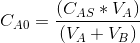
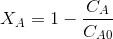
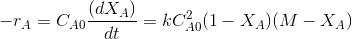
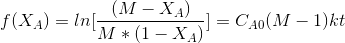
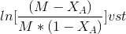
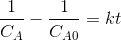
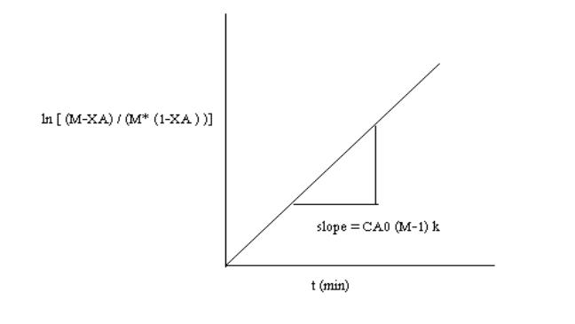

#### Apparatus required :

Measuring cylinders, stop watch.

#### Procedure :
<ol style="list-style-type: number; text-align: justify;">
<li>Standardise the NaOH stock solution and note down its concentration. Note down the strength of ethyl acetate stock solution.</li>

<li>Calculate the volume of NaOH(VB) and ethyl acetate(VA)(required to make the required initial concentration ratio of M (a value equal to or greater than
1) and total reactor volume (select the required volume batch reaction vessel). Choose initial molar ratio of B to A (M) to be taken.
Choose stock concentration of A and the stock concentration of B.
Chose the reaction temperature.
Now calculate the volume of stock solutions of B and A to be taken so as to
maintain the chosen M and the total volume of the reactor. 
VA +VB = VT
.. (1) 
VT is the total reactor volume 
M = (CBS*VB)/(CAS*VA)  = moles of B/ moles of A 
VB/VA =
..
.(2) 
From Eq (1) and (2) ,
VA =......mL , VB=......mL 
Where

VA and VB are the the volumes of ethyl acetate and NaOH stock
to be added to the reactor. 
Cas and Cbs are the concentrations of stock solutions of A and B.</li>

<li>Add the calculated volume of NaOH into the reactor. Start the stirrer.
Switch on the conductivity meter.</li>

<li>Switch on the heater and set the temperature at the desired value. Pump
the water from heating tank for circulation in the jacket .So the temperature in
the reactor is maintained at the required temperature.</li>

<li>Add the required(calculated) volume of ethyl acetate solution ( preheated
to the required temperature) to the reactor and at the same time start the
stopwatch.</li>

<li>At different time intervals of 30s, 1,2,3,5,7,10,15
.min ,note down the
conductivity meter reading (conductivity in mS/cm) of the reaction mixture.Note:
Some conductivity meters may display conductance (mS) not the
conductivity(mS/cm) [ Refer theory for more information].</li>

<li>This procedure is continued until no change in the value of conductivity
meter reading is observed.</li>

<li>Determine the concentration of unreacted NaOH in the reaction mixture by
using the conductivity meter calibration equation. Since the conductivity meter
calibration at 28°C is only provided, calculate the conductivity meter reading at
the required temperature using the temperature compensation equation
provided.</li>
<li>Repeat the experiment at different temperatures.</li>
</ol>

Proceed to calculations as explained in Section A. 

#### Section A :

##### Observations and Calculations :
A -> ethyl acetate 
B -> NaOH 

Concentration of NaOH in the stock solution= gmol/L 
Concentration of ethyl acetate in the stock solution=gmol/L  

 = moles of B/ moles of A 
Initial concentration of A in the reaction mixture,=.....gmol/L 

Initial concentration of B in the reaction mixture =.....gmol/L 

CAS and CBS are the concentrations of stock solutions of A and B. 

Tabular column: For Temperature=

##### Calculations :

Concentration of unreacted NaOH in the reaction mixture= CB=gmol/L 
(from conductivity meter calibration) 
As the conductivity meter calibration is available only at 28&deg;C, the conductivity
meter reading obtained at a given temperature of reaction is to be corrected for 28&deg;C. 
Temperature compensation for conductivity meter 

 
Where ,
YT =conductivity meter reading at any temperature T in mS/cm, 
Y28 = conductivity meter reading at a temperature of 28&deg;c in mS/cm, 
Obtain Y28 corresponding to measured conductivity meter reading ( YT) using the
equation above. 
Conductivity meter is calibrated for concentrations of NaOH in the reaction mixture at a
temperature of 28&deg;. 
Obtain the Concentration of NaOH at 28&deg; using the calibration equation given below 

  
Where,
CB= Concentration of NaOH at time t 
Y28= Conductivity meter reading for solution at time t, corrected for 28&deg;c 
Concentration of ethyl acetate in the reaction mixture, 

=gm
ol/L
 

Conversion of EA, 

 =
  
Since the reaction is elementary, the reaction rate is given by 

  

 
where k is the rate constant. 
In terms of conversion and for M>1, 

 
Where, 
M=CBo/CAo and XA is the conversion of A. 
After breakdown into partial fractions, integration and rearrangement, the final result is 

 
Where  
t= time ,M=CBo/CAo and XA,XA is conversation of A at given time 
The above equation is valid for M>1. 
plot  

  
The rate constant may be calculated from the slope of the line = . 
If M=1,then 
The rate equation may be approximated as
 
Then the integrated form of the rate equation is  
then the plot f(Ca)= 
The plot will yield a straight line with slope=k. 
or plot XA/1-XAthe slope of the line is kCA0. Obtain k 
Rate constant =........ (litre / gmol)min-1 

 
 Obtain the rate constant at three or more different temperatures. 

<table>

<tr height="100">
<td width="50">Temperature T in &deg; k</td>
<td width="100">Rate  constant k in (L/gmol)min-1</td>
</tr>
<tr height="50">
<td width="50"></td>
<td width="50"></td>
</tr>
<tr height="50">
<td width="50"></td>
<td width="50"></td>
</tr>
</table>

From Arrhenius Equation, 

 
Plot lnk vs 1/T 
Determine the activation energy (E) and the frequency factor (ko) from the slope and
intercept of the above plot.  
Intercept= lnk0 
Slope=-E/R 
R is the gas constant Activation energy= E=J/mol 
Frequency factor , k0=min-1(litre/gmol) 
Activation energy= E= J/mol 

##### Result :
The rate constant for the saponification of ethyl acetate with NaOH at a temperature of
&deg;C is, = k =min-1(L/gmol) 

Discuss and conclude on the temperature dependency of rate constant. 
The activation energy (E) for the reaction=J/mol 
The frequency factor (ko)= min-1(L/gmol) 

