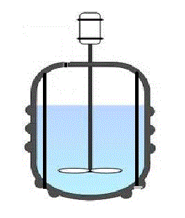
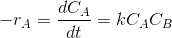
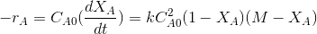
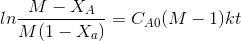
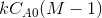
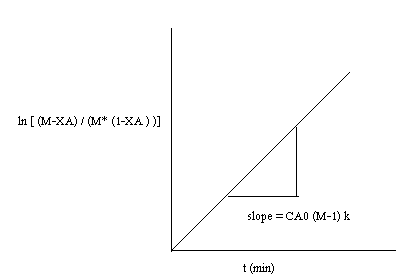
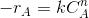

### Background and Theory

The Batch reactor is the generic term for a type of vessel widely used in the
process industries. In a batch reactor the reactants and the catalyst are placed in the
reactor and the reaction is allowed to proceed for a given time whereupon the
mixture of unreacted material together with the products is withdrawn. Provision
for mixing may be required. In an ideal batch reactor, the concentration and
temperature are assumed to be spatially uniform. In practice, the condition can be
approximately realized by vigorous agitation or stirring. All the elements of the
fluid spend the same amount of time in the reactor, and hence have the same
residence time. From the viewpoint of thermodynamics, a batch reactor represents
a closed system. The steady states of the batch reactor correspond to states of
reaction equilibria.

Batch reactors are simple and needs little supporting equipment, and is therefore
ideal for small scale experimental studies on reaction kinetics. Industrially it is used
when relatively small amounts of material are to treated and when the product
demand varies. Batch reactors are often used in the pharmaceutical industry, where
small volumes of high-value products are made.

Researchers typically use a batch reactor to study reaction kinetics under
ideal conditions. A batch reactor can be used to find the reaction rate constant,
activation energy and order of the reaction. The data reflect the intrinsic kinetics
for the reaction being investigated.

A typical batch reactor consists of a tank with an agitator and integral
heating/cooling system. Liquids and solids are usually charged via connections in
the top cover of the reactor. Vapors and gases also discharge through connections
in the top. Liquids are usually discharged out of the bottom.

The advantages of a batch reactor lies in its versatility. A single vessel can
carry out a sequence of different operations without the need to break containment.
This is particularly useful when processing, toxic or highly potent compounds.

#### Material balance :

rate of input - rate of output- rate of disappearance = rate of accumulation  

  
A batch reactor has neither inflow nor outflow of reactants or products while
the reaction is being carried out.  .The resulting general mole balance
on species j is  

  

If the reaction mixture is perfectly mixed so that there is no variation in the relate of
reaction throughout the reactor volume, rj

can be taken out of the integral and the
mole balance can
be written as
  

Consider an elementary reaction ...aA + bB --> cC + dD  
Rate of disappearance of A=-rA=dNA/dt  
Where NA is the number of moles in the reactor at any time
Consatnt volume conditions can be assumed for most of the liquid phase reactions
or for gas phase reactions with no change in number of moles
Then NA=V*CA where CA is the concentration of A in the reactor.
Then -rA=dCA/dt. 
Then for the reaction given above

Where, k= rate constant,
a is the order of reaction w.r.t A and b is the order w.r.t B. If the order of the
reaction w.r.t each reactant are equal to the stoichiometric coefficients of these
reactants, then the reaction is elementary. Else it is non elementary.

Order and the rate constants of the reaction can be obtained by experiments.
Mainly two types of analysis may be used for rate law determination.

(a) Integral method of analysis 
(b) Differential method of analysis. 

Integral method of analysis 
Consider a reaction A+B --> C+D   
Assume a rate equation. 

Like

   

 

where k is the rate constant. 
In terms of conversion and using the  

  
  
Where M=CBo/CAo
and XA is the conversion of A. 
M is the initial ratio of concentrations of B (C Bo)to A(CAo) in the reactor. 
After breakdown into partial fractions, integration and rearrangement, the final
result is  
Plot
  

  

Where ,t= time , M = CBo/CAo,  &nbsp; XA is conversation of A at given time
  The above equation is valid for M>1. 

 

If the data points fits well into a straight line then the assumption of second order
kinetics is true. The rate constant may be calculated from the slope of the line
. 

 
  If M=1 then, 
 

The rate equation may be approximated as   
Then the integrated form of the rate equation is   
Then plot  

If the rate equation assumed is right, then the plot fits well into a straight line with
slope=k. 
b) Differetial method of analysis. 

 <ul style="list-style-type: circle; text-align: justify;">
  <li>Hypothesize a rate equation. Let this be . where n is the assumed order.</li>
  <li>Obtain concentration(CA) vs. time data from the batch experiments. Draw
CA vs. time. Draw tangents at various points . Find the slopes. These slopes
are dCA/dt
are the rates of reaction(-rA) at these concentrations.</li>
  <li>Taking logs on both sides of the rate equation will give ln(-rA)=lnk+n.</li> 
ln(-CA)
  <li>Plot of ln(-rA) vs ln(-CA) will give a straight line with slope n (order) if the
assumed form of rate equation is correct. k may be obtained from the
intercept. </li>

</ul>

The reaction rate, r, is generally dependent on the reactant concentration and the
rate constant (k). The rate constant can be determined by using a known empirical
reaction rates that is adjusted for temperature using the <u>Arrhenius temperature
dependence</u>. Generally, as the temperature increases so does the rate at which the
reaction occurs. 
Temperature dependency of rate is given by Arrhenius equation. 

 
Where k is the rate constant. k0 is the frequency factor. E is the activation energy, R
is the gas constant ,T is the absolute temperature.

